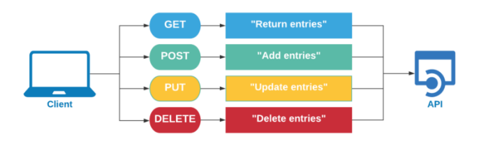
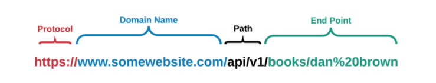
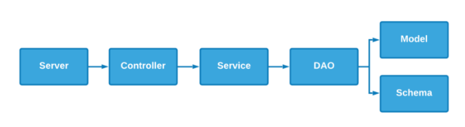
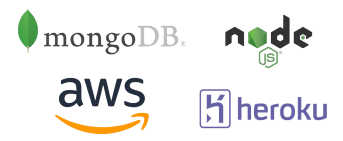

# Develop and Deploy a Scalable RESTful API using Node.js & Mongo.

[Check out the Medium Article!](https://alkhalifas.medium.com/develop-and-deploy-a-scalable-restful-api-using-nodejs-mongo-232ad79e0f6c)

## Full Crud Operations:

## Six Different API Endpoints:
- Get All books
- Get Books by ID
- Get Books by Author
- Add New Book
- Update Existing Book
- Delete Book

## Server Architecture:
- Full decoupling of all functions
- Integration with Mongoose within DAO
- Connected to remote Mongo server

## Software Stack:

